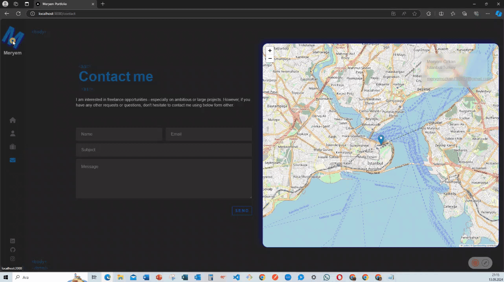

<h1> My Portfolio 🚀</h1>

Welcome to my portfolio project! This project showcases my skills and projects using a variety of modern web technologies.  

<h1> 🛠 Technologies Used </h1>

Here are the key technologies and libraries that I used to build this project:  

- @emailjs/browser: Used to send emails directly from the browser without a server. 
- @fortawesome/fontawesome-svg-core: Core library for FontAwesome icons. 
- @fortawesome/free-brands-svg-icons: Brand icons from FontAwesome (e.g., GitHub, LinkedIn, Twitter). 
- @fortawesome/free-solid-svg-icons: Solid icons from FontAwesome for various UI elements. 
- @fortawesome/react-fontawesome: A React component for FontAwesome icons. 
- animate.css: A library of CSS animations for making the UI more engaging. 
- GSAP: A powerful JavaScript animation library used to create custom animations. 
- loaders.css: CSS loader animations for various loading states. 
- react-leaflet: A React wrapper for Leaflet maps, allowing you to embed maps in your portfolio. 
- react-loaders: A React wrapper for loaders.css to easily add loading animations. 
- react-router-dom: A React library for routing and navigation between different sections of the portfolio. 
- sass: A CSS preprocessor that allows for better structuring and styling of the project. 

<h1> 💻 Project Features </h1>

1. Responsive Design
   The portfolio is fully responsive, meaning it adapts beautifully to all screen sizes (mobile, tablet, desktop).  
2. Smooth Animations
   Used GSAP and animate.css to add smooth transitions and engaging animations throughout the website. 
3. Interactive Map
   Integrated a map using React-Leaflet, where users can interact with locations of completed projects or personal details. 
4. Contact Form
   The contact form is powered by EmailJS, enabling users to send emails without needing a backend server. 
5. Projects Showcase
   Projects are displayed with a sleek design, and each project can be explored in detail with technologies used and the functionality it offers. 
6. Iconography
   FontAwesome icons are used throughout the portfolio to provide a visually appealing and consistent design. 

<h1> 📧 Contact </h1>

Email: meryemozkan718981@gmail.com  

LinkedIn: https://www.linkedin.com/in/meryem-ozkan/  

Twitter: https://x.com/meryemozkanmltm  

<h1> 🔗 GIF </h1>

